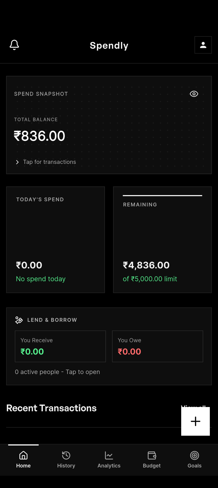
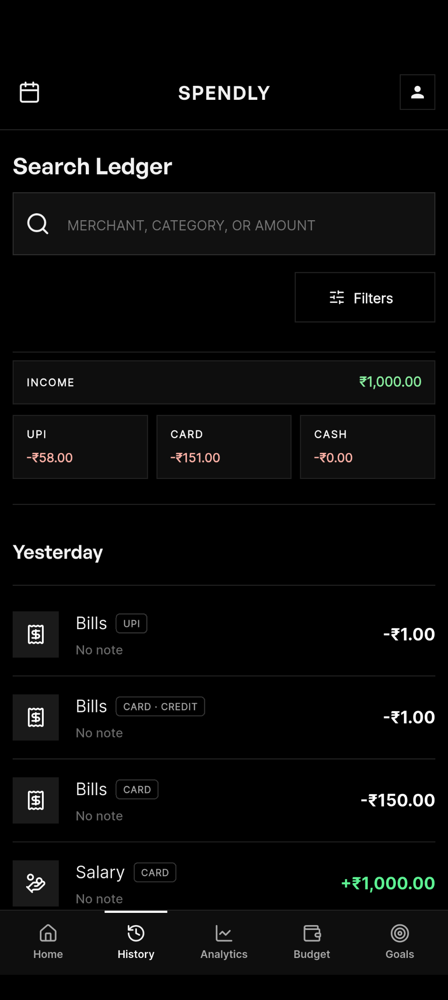
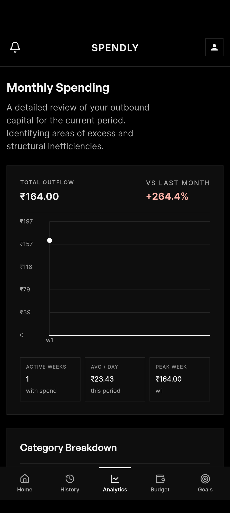
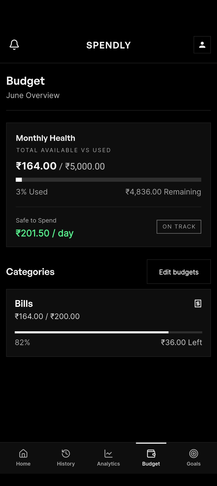
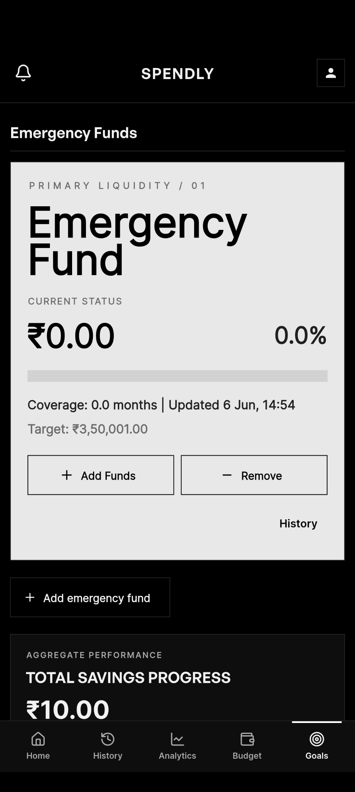
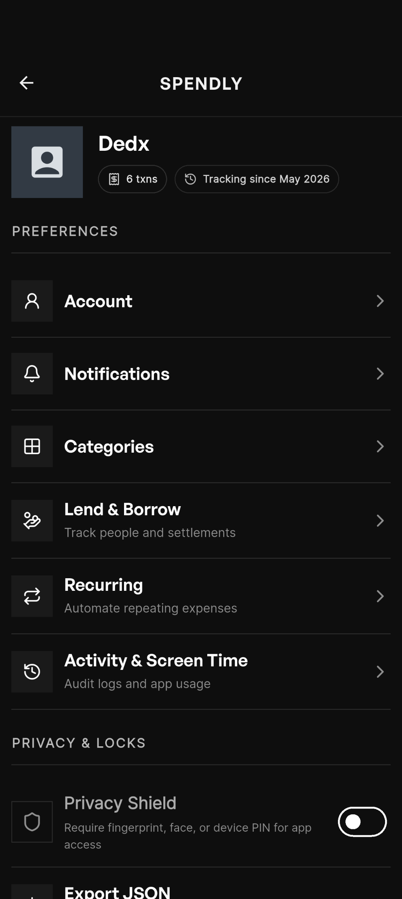

# Spendly

<div align="center">

Offline-first personal finance tracker built with Flutter.

Track expenses, manage budgets, analyze spending habits, and stay in control of your money — completely offline.

</div>

---

## Features

### Expense Management

- Add income and expenses
- Categorized transactions
- Transaction history
- Search and filtering
- Monthly summaries

### Budget Tracking

- Monthly budget planning
- Remaining budget calculation
- Budget alerts
- Spending progress tracking

### Analytics

- Spending insights
- Category-wise breakdown
- Monthly trends
- Income vs Expense analysis
- Interactive charts

### Recurring Transactions

- Automatic recurring entries
- Monthly subscriptions
- Bills and rent tracking
- Scheduled transaction generation

### Privacy & Security

- Biometric authentication
- Device PIN authentication
- Privacy lock screen
- Hide sensitive amounts

### Notifications

- Daily reminder notifications
- Budget exceeded alerts
- Local notifications

### Backup & Sync

- Google Sign-In
- Google Drive backup support
- Local-first data ownership

### Offline First

- Works without internet
- SQLite powered storage
- Fast local performance
- No dependency on backend services

---

## Screenshots

<p align="center">
  
  
  
</p>

<p align="center">
  
  
  
</p>

## Tech Stack

### Frontend

- Flutter
- Material 3

### State Management

- Riverpod
- Riverpod Generator

### Local Database

- Drift ORM
- SQLite

### Navigation

- GoRouter

### Code Generation

- Freezed
- JSON Serializable
- Build Runner

### Charts & Analytics

- fl_chart

### Authentication

- local_auth
- Google Sign-In

### Notifications

- flutter_local_notifications

---

## Architecture

```text
lib/
│
├── app/
│   ├── router
│   └── app setup
│
├── core/
│   ├── database
│   ├── theme
│   ├── notifications
│   ├── utils
│   └── services
│
├── features/
│   ├── home
│   ├── history
│   ├── budget
│   ├── analytics
│   ├── recurring
│   ├── notifications
│   ├── settings
│   └── onboarding
│
└── shared/
```

The project follows a feature-first architecture to keep business logic isolated and maintainable.

---

## Getting Started

### Prerequisites

- Flutter SDK 3.9+
- Dart SDK
- Android Studio / VS Code

### Installation

Clone the repository:

```bash
git clone https://github.com/DedxAB/spendly-expense-tracker-app.git
```

Navigate to project:

```bash
cd spendly-expense-tracker-app
```

Install dependencies:

```bash
flutter pub get
```

Generate code:

```bash
dart run build_runner build --delete-conflicting-outputs
```

Run application:

```bash
flutter run
```

---

## Roadmap

### Planned

- Smart transaction search
- AI-powered spending insights
- CSV import/export
- Multi-currency support
- Advanced recurring rules
- Financial goals
- Savings recommendations

---

## Why Spendly?

Most finance apps require:

- Account creation
- Cloud storage
- Internet access

Spendly focuses on:

- Privacy
- Offline-first experience
- Speed
- Simplicity
- User-owned data

---

## License

MIT License

---

## Author

Built by Arnab Bhoumik

GitHub:
https://github.com/DedxAB